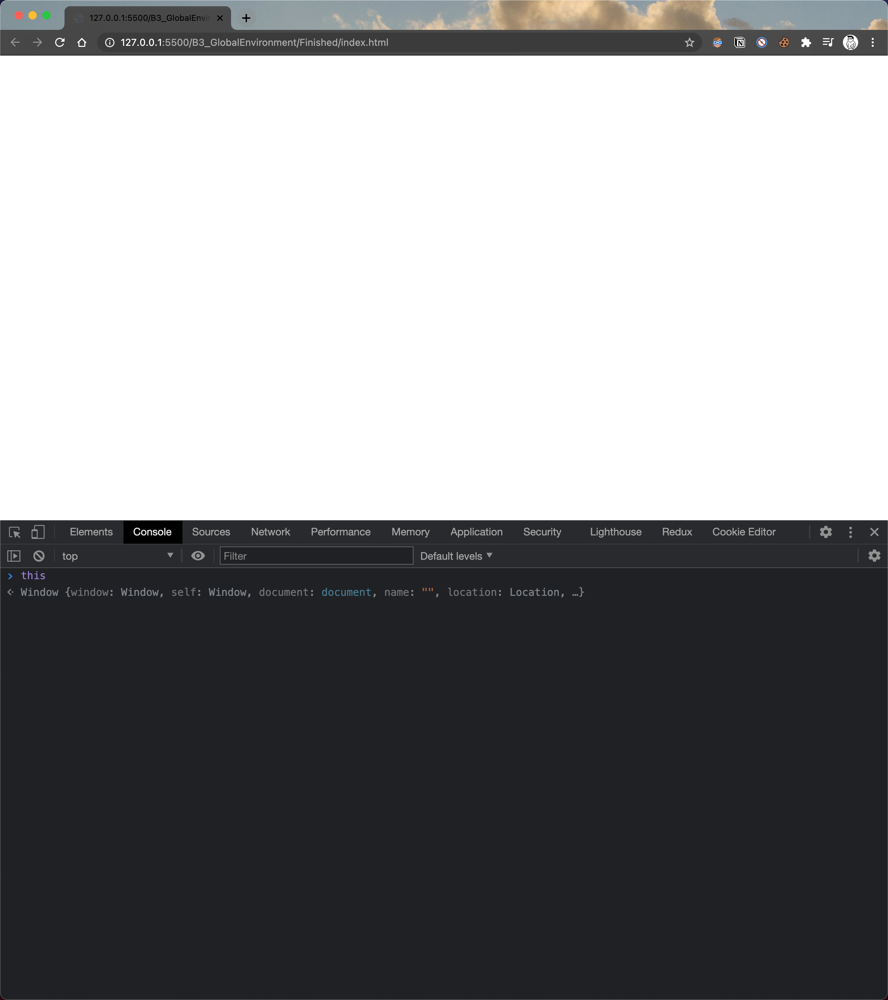

## EC

不論何時執行，JS 一定會在執行環境，把正在執行的程式碼包在執行環境裡。

## 基礎執行環境就是 Global 執行環境

1. GC 創造了 Global Object，與 `this`

## 試試看

對 index.html 執行 Live preview，輸入 `this`

現在的 `this` 是 `window`，代表我現在運行的這個瀏覽器視窗，當然，如果是在 node.js 執行，則會是 `global`

每個分頁都會有他自己的 `window`

這些東西就是執行環境幫我們創造的，這就是全域物件

`this === window`

window 和 this 不需要程式碼就會被創造，他們不在函式裡

在 global 寫點 code，他們會在 window 裏面。

當程式被執行時，如果不在函式裏面，就會在 window 裏面，也就是在 global 裏面，所以以 app.js 來說，this.a === window.a

因為已經在最外面了，所以 Outer Environment 會是 `null`

## Hoisting

